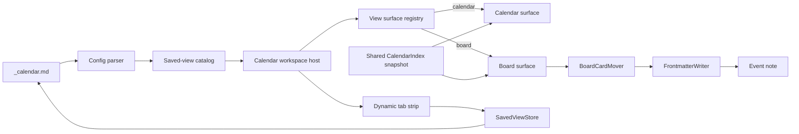

# Saved views 与 Board v1 技术设计与验收

状态：已实现并验证

发布版本：0.1.8

迁移基线：0.1.7（不包含 Saved views 或 Board）

范围：Saved views foundation + Board v1

更新日期：2026-09-05

本文同时记录当前技术契约与按日期保存的验证事实。标有日期的验证记录是当时结果，测试数量和中间交互不应被当成滚动更新的现行规范。

## 已确认方向

视图不是写死的 **Calendar view + Board** 两个 tab。一个 `_calendar.md` 数据源拥有一组有序的 saved views，用户通过 view 列表末尾的 **+** 创建视图；其 tooltip 和无障碍名称为 **Add a new view**。Calendar 和 Board 是 v1 首批支持的两种 view type，而不是两个固定实例。

本版采用以下产品结论：

- 同一个 calendar 可以创建多个 Calendar view 和多个 Board view。
- 每个 saved view 有稳定 `viewId`、可修改的名称、类型和类型专属配置。
- tab 从 `calendar-views` 数组动态生成，数组顺序就是 tab 顺序。
- Calendar view 的 Month/Week 与 week start 属于该视图；Board 的 group property 也属于该视图。
- 所有视图共享同一数据源、属性 schema、卡片颜色配置和增量索引。
- 切换视图只修改 UI state；添加、编辑、重命名和删除视图才修改 `_calendar.md`。
- v1 支持添加、编辑、重命名和删除视图；至少保留一个视图。
- v1 暂不实现所有 Notion view types、filter/sort、复制视图和 tab 拖动排序。

> Board 仍是本次新增的主要呈现能力，但 saved-view 基础必须先落地，否则固定 Board tab 很快会被推翻。

## 背景与设计依据

Notion 的核心语义是：同一份数据库数据可以拥有任意多个命名视图，使用 `+` 创建视图并选择布局；每个视图保存自己的布局设置。Board 再按某个属性把页面分组：

- [Notion：Database views, filters, sorts & groups](https://www.notion.com/help/views-filters-and-sorts)
- [Notion：Create a database](https://www.notion.com/help/create-a-database)
- [Notion：Board view](https://www.notion.com/help/boards)

用户提供的截图只作为视觉参考，用来确认：

- 视图入口位于内容顶部，以图标和名称组成横向 tab。
- 当前视图有清晰的选中态。
- **New** 和其他共享操作位于右侧。

截图不是功能清单。Idea、Timeline、Filter、Sort、Search、Automation 等未实现能力不应先出现为无效按钮。

## 实施基线与当前保留边界

0.1.7 的发布代码已经具备以下可复用的数据与交互基础：

- `src/main.ts` 只注册一个稳定的 Obsidian workspace view type。
- `src/services/open-adapter.ts` 使用稳定值 `calendar-view` 打开 `_calendar.md`。
- `src/services/calendar-index.ts` 负责来源范围、增量更新、关系派生和共享 snapshot。
- `src/domain/property-values.ts` 已定义 Select、默认值和 `None` 的解析语义。
- `src/ui/calendar-card.ts` 已提供标题之外的关系行和属性内容。
- `src/services/frontmatter-writer.ts` 已为日期拖拽提供文件存在性和 `mtime` 冲突保护。
- 0.1.7 的 `src/ui/calendar-view.ts` 约 992 行，集中实现打开、编辑、新建、删除、日期拖拽和范围 resize。

以下四项是本次实施前需要解决的问题，已在 0.1.8 中解决：

1. 0.1.7 的 `CalendarConfig.layout` 与 `weekStartsOn` 是 calendar 级字段，无法表达两个配置不同的 Calendar saved views。
2. 0.1.7 的 `CalendarUiState` 只有一份 `focusDate/scrollTop`，无法隔离多个 view instance。
3. `CalendarView` 同时承担宿主生命周期、Calendar 渲染和交互；现已抽出独立的 `calendar-surface.ts` 与 `board-surface.ts`。
4. 0.1.7 的整份 `CalendarConfig` 保存方式可能让两个 leaf 用 stale config 相互覆盖 saved views，需要按 `viewId` 原子写入。

当前仍保留一项明确边界：`CalendarItem.start` 仍为必填；缺少或包含非法日期的笔记只进入 issues，不进入 `snapshot.items`，因此 Board v1 也不展示它们。

## 产品范围

### v1 包含

- 从配置动态渲染任意数量的 saved-view tabs。
- tab strip 末尾随 hover 或键盘 focus 显示的 icon-only **+**；仅在 catalog 可安全写入时启用。
- 添加 Calendar 或 Board，可重复添加同一种类型。
- 创建时输入名称并完成类型专属设置。
- **Edit view**、**Rename** 和 **Delete view**。
- Calendar saved view 独立保存 Month/Week 和 week start。
- Board saved view 独立保存一个 Select 类型的 group property。
- 每个 leaf 按稳定 `viewId` 恢复 active view 和各视图 UI context。
- Board 按 Select options 生成列，包括空列和 `None` 列。
- Board 展示索引中的全部有效日期事件，每个事件只出现一张卡。
- Board 跨列拖拽只更新当前视图的 group property。
- tab、添加流程、卡片打开的基础键盘和无障碍语义。

### v1 不包含

- Calendar、Board 之外的 Table、List、Gallery、Timeline 等布局。`Idea` 可以是任意 saved view 的名称，但 v1 不自动赋予它筛选语义。
- Filter、Sort、Search、Automation 和每个视图独立的属性可见性。
- Duplicate view、Copy link to view、Set as default。
- tab 拖动重排、`N more` 管理界面和 icon-only/text-only 模式。
- 把既有 view 原地转换成另一种 type；需要时新增后删除旧 view。
- linked database、跨数据源 view 或运行时第三方 renderer 插件系统。
- Board sub-group、swimlane、隐藏列、列折叠、列重排和列内手工排序。
- 卡片封面、图片预览和多种卡片尺寸。
- Board 内调整日期范围。
- 列内 **+ New** 和 **New** 下拉菜单。
- 键盘跨 Board 列移动；键盘用户可打开现有编辑器修改属性。
- Board 中展示无日期或日期非法的笔记。
- 自动创建 Select 属性或批量迁移 option value。
- 移动端和触控。
- 插件名称、manifest id、`calendar-view: true` marker 或 workspace view type 的重命名。

## 概念模型

| 概念 | v1 定义 |
| --- | --- |
| Calendar document | `_calendar.md`；保存数据源、属性 schema、共享配置和 saved views |
| Saved view | 同一数据源的一种命名呈现，拥有稳定 ID 和类型专属配置 |
| View ID | 文档内唯一、不透明、创建后不变；名称和数组位置都不是身份 |
| View type | v1 为 `calendar` 或 `board`；决定使用哪个 renderer |
| View instance | `viewId` 指向的具体 saved view；两个 Board 是两个不同实例 |
| Active view | 当前 leaf 正在显示的 `viewId`，属于 UI state |
| Calendar item | 当前 `CalendarItem`，即具有合法开始日期的 scoped Markdown note |
| Board column | 当前 Board view 的 Select option；`None` 也是正式列 |

## 顶部与视图管理

### 动态 tab strip

当前顶部结构：

```text
[file] Work   [Calendar view] [Work board] [By type] [+]   [2 unscheduled] [settings] [New]

Calendar view:
[September 2026]                                      [<] [Today] [>] [Month/Week]

Work board:
[None 2] [Not started 8] [Blocked 1] [In progress 4] [Abandoned 0] [Done 12]
```

行为要求：

- tab 数量、名称、图标和顺序来自 `SavedViewCatalog.entries`。具有唯一合法 ID 的 unknown/semantic-invalid entry 保留原位置并显示 unavailable；缺失或重复 ID 的 entry 只能进入 catalog 诊断，不能成为可操作 tab。
- `+` 是独立的 **Add a new view** 按钮，不属于 `tablist`。它紧跟最后一个 tab，默认视觉隐藏，在 view list hover 或 focus-within 时显示，并带明确 `aria-label` 与顶部 tooltip；触屏环境保持可见。
- 相邻 view tab 保持 `6px` 间距，避免选中态边框和 focus ring 视觉粘连。
- tab strip 溢出时横向滚动；active tab 自动滚入可见区，`+` 保留在 scroller 外并紧随其后，右侧共享操作保持可见。
- tab 使用 `role="tablist"`、`role="tab"`、`aria-selected` 和对应 `tabpanel`。
- 左右方向键移动 tab 焦点，Home/End 到首尾，Enter/Space 激活。
- active 状态和 keyboard focus ring 必须可区分。
- Calendar 的日期标题、导航、**Today** 和 Month/Week 只在 Calendar type 显示。
- Board 不显示空的第二工具栏，也不显示尚未实现的工具图标。
- **unscheduled**、全局设置、**New** 和打开源文档仍是共享操作。

### 添加视图

选择 view 列表末尾显示的 **+**（tooltip 为 **Add a new view**）打开单一 modal：

1. 选择类型：**Calendar** 或 **Board**。
2. 输入名称。
3. 完成类型专属设置：
   - Calendar：`Month` 或 `Week`，以及 week start。
   - Board：**Group by**，只列出可写的 Select 属性。
4. 选择 **Create**。

默认值：

- Calendar 默认名称为 `Calendar view`；已有同名时依次使用 `Calendar view 2`、`Calendar view 3`。
- Board 默认名称为 `Board`；已有同名时依次使用 `Board 2`、`Board 3`。
- 名称 trim 后必须非空。Add/Rename UI 以大小写不敏感方式拒绝同名，并在提交时基于最新 catalog 再校验；名称仍不是身份，解析器会按 ID 保留手工 YAML 中的历史同名并显示 warning。
- 新 Calendar 默认 `month`；week start 优先复制当前 Calendar view，否则复制第一个 Calendar view，再否则使用 `locale`。
- 新 Board 在表单中预选合法的 `status`，没有时预选第一个合法 Select。
- 没有合法 Select 时仍可查看 Board 类型，但 **Create** 禁用，并显示 **Add a select property first.** 与打开 **Properties** 设置的入口。选择该入口会关闭 Add view modal、丢弃未保存草稿并打开 Properties；创建 Select 后由用户重新执行 Add view，避免嵌套 modal 和过期 schema。

`BoardSavedView.groupBy` 保持 optional，是为了表达属性后来被删除、手工 YAML 缺失或中间版本迁移产生的 repair/setup state；Add view UI 本身仍要求提交时存在合法 group property。

提交语义：

- 先把新 definition 保存到 `_calendar.md`，成功后才增加 tab 并激活。
- 保存失败时 modal 保持打开并保留输入，不出现只存在于 DOM 或 UI state 的幽灵 tab。
- 新视图追加到数组末尾。
- 添加视图不扫描 vault，也不修改事件笔记。

### 视图菜单

view tab 不显示常驻或 hover 三点按钮。可写的 view 在 tab 上右键打开菜单；键盘使用 Menu key 或 Shift+F10 打开同一个菜单。所有动作绑定触发菜单的 `viewId`，编辑或重命名非 active tab 不应顺带激活它：

- **Edit view**：Calendar 修改 layout/week start；Board 修改 group property。
- **Rename**：只修改 `name`，不修改 `id`、type 或 UI state 引用。
- **Delete view**：删除 view definition，不删除任何事件笔记或属性。

v1 规则：

- type 创建后不可变。
- Rename 的 Enter 保存、Escape 取消；保存失败保留原名称。
- 删除后必须至少剩一个可渲染的已知 view；否则 **Delete view** 禁用。
- 删除前确认：`Delete “Board”? This removes only the view. Event notes will not be deleted.`
- 删除 active view 后选择最近的可渲染右侧相邻项；没有时选择左侧。
- 删除非 active view 不改变当前 leaf。
- unavailable tab 不提供 Edit/Rename/Delete；catalog 结构错误时所有 saved-view mutation 都禁用，只保留源文件修复入口。
- 保存失败时不移除 tab，也不改变 active view。
- v1 按创建顺序显示，不提供拖动排序。

### 切换与新建事件

- 切换只更新 `CalendarUiState.activeViewId` 并激活对应 surface，不保存 `_calendar.md`。
- 已有 leaf 优先恢复自己的有效 ID；没有 leaf state 时沿用 shared state；ID 失效时回退到 catalog 中第一个可激活的 valid view；一个都没有时显示 catalog repair state。
- 从一个 view 切到另一个 view 不重新扫描 vault。
- Calendar 中 **New** 使用该 view 当前 `focusDate`。
- Board 中 **New** 使用调用时的 `todayPlainDate()`，不改变任何隐藏的 Calendar view focus。
- Board 新事件沿用属性 schema 的 default；当前 Board 列本身不隐式改写新事件的 group value。
- 两种入口都保留现有 `EventTitleModal` 契约：Enter 不创建也不关闭；关闭动作仅在创建成功后结束；失败保留 draft；不重新加入 Create button。

## Saved-view 配置

### Canonical YAML

`_calendar.md` 新增版本化、有序的 view definitions：

```yaml
calendar-views-version: 1
calendar-views:
  - id: calendar
    name: Calendar view
    type: calendar
    layout: month
    week-starts-on: locale
  - id: 24763e20-4957-4f45-98c3-23173b90a43e
    name: Work board
    type: board
    group-by: status
  - id: 9cc70b2e-7b91-4f92-a43f-4300c437b9b1
    name: By type
    type: board
    group-by: type
```

内部类型：

```ts
type ViewId = string;
type SavedViewType = 'calendar' | 'board';

interface SavedViewBase {
	id: ViewId;
	name: string;
}

interface CalendarSavedView extends SavedViewBase {
	type: 'calendar';
	layout: CalendarLayout;
	weekStartsOn: WeekStartsOn;
}

interface BoardSavedView extends SavedViewBase {
	type: 'board';
	groupBy?: string;
}

type SavedView = CalendarSavedView | BoardSavedView;

type SavedViewCatalogEntry =
	| {
			kind: 'valid';
			definition: SavedView;
			warnings?: ViewConfigIssue[];
	  }
	| {
			kind: 'invalid';
			id?: string;
			name?: string;
			raw: unknown;
			issues: ViewConfigIssue[];
	  }
	| {
			kind: 'unsupported';
			id?: string;
			name?: string;
			viewType?: string;
			raw: unknown;
	  };

interface SavedViewCatalog {
	source: 'legacy' | 'canonical';
	entries: SavedViewCatalogEntry[];
	canMutate: boolean;
}

interface CalendarConfig {
	// Existing shared source, schema, card and behavior fields.
	// Transitional compatibility: parsed and newly created configs provide it.
	viewCatalog?: SavedViewCatalog;
}
```

共享配置可用时，即使 catalog 有局部或结构问题，parser 也返回带 `config.viewCatalog` 的 config；只有 shared fatal issue 才令 config 缺失。类型目前仍把 `viewCatalog` 标为 optional，供旧调用方渐进迁移；saved-view-aware host 和 writer 必须显式补默认 catalog 或 fail closed，不能把缺失当成空列表。renderer 只消费 `kind: 'valid'` 的 definition；tab strip 消费完整 entries，因此 unknown/invalid entry 能保留原始位置、名称和 raw 数据。`SavedViewStore` 也从 raw frontmatter 重新建立 catalog，而不是从 valid definitions 反序列化，避免修复无关设置时丢条目。

不变量：

- `id` 在一个 calendar document 内非空且唯一。
- 显式 ID 必须是 1–64 个字符的小写字母、数字和连字符，且不能以连字符开头或结尾；parser 不 trim、转小写或现场修补它。
- 新 ID 由注入式 ID factory 产生，不能由名称、type 或数组下标推导。
- legacy Calendar 的稳定 ID 为 `calendar`；新建时生成 ID 后必须与当前 catalog 检查冲突，不主动复用已存在的 ID。
- `name` trim 后非空，但不是 identity。
- 数组顺序是 tab 顺序；至少存在一个 entry。
- type 是判别字段，创建后不原地改变。
- Calendar 的 `layout/weekStartsOn` 和 Board 的 `groupBy` 都是 per-view 配置。
- `sourceFolder`、日期字段、`propertyDefinitions`、`visibleProperties`、`cardColorProperty`、`openBehavior` 和 exclude paths 在 v1 仍为 calendar 级共享配置。
- `calendar-board-group-property` 不再是 canonical/global 配置；不同 Board view 各自保存 `group-by`。

0.1.7 的 **Calendar settings → View** 曾包含 Layout 和 week-start 控件；它们现已迁入对应 Calendar tab 的 **Edit view**。全局设置继续管理数据源、日期字段、属性 schema、卡片共享显示和打开行为，避免同一个值同时出现在两个设置入口。

### Legacy 迁移

0.1.7 发布版本只有扁平的 `calendar-layout` 和 `calendar-week-starts-on`。确定性迁移规则：

1. 只有当 `calendar-views-version` 和 `calendar-views` 都缺失时，才按 legacy 读取。
2. legacy 读取只在内存合成一个 view：

   ```ts
   {
	   id: 'calendar',
	   name: 'Calendar view',
	   type: 'calendar',
	   layout: legacyLayout,
	   weekStartsOn: legacyWeekStartsOn,
   }
   ```

3. 若 canonical 缺失但 pre-release/intermediate key `calendar-board-group-property` 实际存在，再合成 `id: board` 的 Board view；空值表示合法 setup，非空值原样保留并做 view-local 校验。该 key 不属于 0.1.7 released schema。
4. 单纯打开旧文档不写文件。
5. 第一次成功的 `_calendar.md` 配置 mutation（包括 add/edit/rename/delete view、全局设置或属性迁移）在同一 transaction 中写入完整 v1 schema，并删除旧 `calendar-layout`、`calendar-week-starts-on` 和 `calendar-board-group-property`。
6. `calendar-views` 一旦存在就是唯一权威来源，不长期双写无法表达多 Calendar view 的 legacy key。
7. 新建 calendar 直接创建一个 `id: calendar` 的 Calendar saved view。

如果 canonical keys 与 legacy keys 同时存在，v1 配置优先，legacy keys 只产生非阻断 warning，并在下一次 view mutation 时删除。显式 v1 配置无效时不得退回 legacy，否则会掩盖损坏。

旧版插件降级后会退回自己的默认 Calendar layout，但事件数据和共享 schema 不受影响。该取舍优先避免 canonical 与 compatibility shadow 形成 split-brain。

### 解析与错误级别

saved-view 错误必须与共享 Calendar config 错误分层：

- shared fatal issue：数据源、日期字段等令所有视图无法工作。
- catalog structural issue：未知 version、version/list 只存在其一、非数组、空数组、entry 非 map、缺失/非法/重复 ID、空名称、未知 type 或无法无损保存的未知字段。
- view-local semantic issue：Board 没配置 group、group 引用丢失或不再是可写 Select；Calendar 缺失 layout/week start 可使用明确默认值，但显式非法值只禁用该 view，不静默换值。

处理规则：

- catalog 有结构错误时禁止 saved-view 写入，避免 normalized serializer 静默删除未知或冲突 entry。
- 仍可渲染所有 ID 唯一、type 已知且配置可用的视图；具有唯一 ID 的 unknown/semantic-invalid entry 可显示 unavailable tab，缺失/重复 ID 则只显示 catalog 级修复诊断。
- 不现场生成 ID、不任选重复 ID 中的一项，也不在保存其他设置时吞掉原始 entry。
- view-local issue 只禁用对应 surface；其他 Calendar/Board 继续工作。
- Board `groupBy` 缺失是可修复 setup state，不令整个 `CalendarConfig` fatal。

## Board 视图语义

### Group property

每个 `BoardSavedView.groupBy` 独立。统一使用：

```ts
isWritableBoardGroupProperty(
	config: CalendarConfig,
	property: string,
): boolean;
```

候选属性必须：

- 存在于 `propertyDefinitions`。
- 类型为 Select。
- 不是 start/end date property。
- 不是 reserved property。
- 不是 `position`。
- Select options 不重复。

设置、Add view modal、view resolver、Board projection 和 drop 写入必须复用同一判断。

### 列与卡片

- 每列首选宽度为 `260px`；容器空间不足时可按比例收缩到 `200px`，避免普通宽度窗口出现不必要的横向滚动。
- 只有列数或容器宽度使所有列无法保持 `200px` 时才横向溢出；此时继续保留 Board 边缘自动滚动。
- 列严格使用 `selectPropertyOptions()` 的规范顺序；空列仍显示。
- `None` 固定存在并位于首位。
- 缺失值有 default 时进入 default 对应列。
- 缺失值没有 default、显式 `None` 或未知旧 option 值进入 `None`。
- 未知旧值只在投影中归入 `None`，不借渲染清洗源笔记。
- 卡片顺序为开始日期、开始时间、title、path；v1 不持久化手工顺序。
- 卡片显示 title、关系、共享 visible properties、日期或日期范围；title 为空时只在 UI 中显示 **New page**，底层 title 仍为空。
- 日期始终显示且不受 `visibleProperties` 控制：单日为 `YYYY-MM-DD`，范围为 `start – end`。
- 卡片颜色继续由共享 `cardColorProperty` 决定，与当前 Board 的 `groupBy` 相互独立。
- 不继承 Calendar 的 absolute positioning、固定高度和 resize handle。

### 打开、删除与跨列拖拽

- 单击、Enter 或 Space 打开现有事件编辑器。
- Command/Ctrl-click 和中键继续在新 tab 打开源笔记。
- 右键卡片菜单仍然只有 **Move to trash**。

跨列 drag/drop 只表示“改变当前 Board view 的 group property”：

1. `dragstart` 捕获 `viewId`、item path、`mtime`、当前投影列。
2. `dragover` 只高亮有效目标列；空列保留足够大的 drop target。
3. UI 用 effective value 判断同列 no-op；不借机清洗缺失或未知 raw value。
4. drop 时按 `viewId` 重新读取当前 definition，确认 view 仍存在、`groupBy` 未改变、目标 option 仍有效。
5. 写入只改变一个 frontmatter 字段；日期、关系和其他属性保持不变。
6. 拖到 `None` 显式写入字符串 `None`，不能删除 key，否则 default 会令卡片刷新后跳回。
7. 文件不存在、`mtime` 改变或 view/config 在拖拽期间变化时取消并显示 Notice。
8. 切换 tab、删除 view、关闭 workspace view 或配置 refresh 时取消 session、清除高亮且不写文件。
9. 写入成功后等待 index 正式 snapshot；它是新属性、颜色和 `mtime` 的权威结果，等待期间禁止再次拖动该卡片。
10. Board 左右边缘自动横向滚动，确保屏外列可成为 drop 目标。

Board 不复用 `moveDateRange()`。Calendar drag 只改日期，Board drag 只改分组属性，两类 session 相互隔离。

现有 Calendar 曾出现原生 `dragstart` 后 `pointercancel` 提前清除 session 的问题。Board 回归测试必须覆盖同一事件序列。

## 架构设计

### 总体数据流



### Workspace host 与 renderer registry

保留一个 Obsidian workspace view type。`CalendarView` 收缩为共享宿主，负责：

- acquire/release 一个共享 `CalendarIndex`。
- 渲染 calendar identity、动态 tabs、Add view 和共享操作。
- 解析 `activeViewId` 并按 `SavedView.type` 选择 renderer。
- 在视图切换时交接 per-view UI state。
- 统一展示 config/index banner。

renderer 使用静态、穷尽式 registry：

```ts
interface ViewSurface<
	TDefinition extends SavedView = SavedView,
	TState extends SavedViewUiState = SavedViewUiState,
> {
	mount(container: HTMLElement, input: ViewSurfaceInput<TDefinition>): void;
	update(input: ViewSurfaceInput<TDefinition>): void;
	primaryAction(): ViewSurfacePrimaryAction;
	cancelInteraction(message?: string): void;
	deactivate(): TState;
}

type ViewSurfaceFactory<
	TDefinition extends SavedView = SavedView,
	TState extends SavedViewUiState = SavedViewUiState,
> = (dependencies: ViewSurfaceDependencies) => ViewSurface<TDefinition, TState>;

const VIEW_SURFACE_FACTORIES = {
	calendar: createCalendarSurface,
	board: createBoardSurface,
} satisfies {
	calendar: ViewSurfaceFactory<CalendarSavedView, CalendarSurfaceState>;
	board: ViewSurfaceFactory<BoardSavedView, BoardSurfaceState>;
};
```

规则：

- registry 以 type 为 key，不以 `viewId` 为 key。
- 宿主同一时间只 mount 一个 active surface。
- Board A 切到 Board B，即使 type 相同，也先 deactivate A，再为 B 建立独立实例。
- `deactivate()` 同步取消交互、清理 listener/timer，并返回该 `viewId` 的 UI state。
- 当前 definition、schema 或 config revision 变化时，宿主先调用 `cancelInteraction()`，再把新 input 交给 `update()`；view 切换和关闭则调用 `deactivate()`。
- 每个 surface 使用 Obsidian 子 `Component` 或私有 cleanup registry，只在 mount 注册一次。
- `update()` 在交互期间缓存 latest snapshot，结束或取消后再应用，不能让宿主重渲染销毁正在拖动的 DOM。
- Calendar surface 拥有 card metrics、absolute layout、today timer、日期 drag/resize 和 “No scheduled notes”。
- Board surface 拥有列、横向滚动、普通文档流卡片和 Board drag。

这是编译期 registry，不是运行时插件系统。将来添加 Timeline 时扩展判别联合与 registry，TypeScript 应指出遗漏的 renderer 和测试。

### SavedViewStore seam

Add/Edit/Rename/Delete 不得拿 leaf 中的旧 `CalendarConfig` 重写整份 `calendar-views`。两个 leaf 同时操作时，后保存者会覆盖前一个。

增加按 ID 应用命令的深 module：

```ts
type SavedViewCommand =
	| { kind: 'add'; view: SavedView }
	| { kind: 'rename'; viewId: ViewId; name: string }
	| {
			kind: 'configure-calendar';
			viewId: ViewId;
			layout: CalendarLayout;
			weekStartsOn: WeekStartsOn;
	  }
	| { kind: 'configure-board'; viewId: ViewId; groupBy?: string }
	| { kind: 'remove'; viewId: ViewId };

commit(
	documentPath: string,
	command: SavedViewCommand,
): Promise<SavedViewCatalog>;
```

`SavedViewStore` 在 `processFrontMatter` 的当前值上重新解析、校验并应用一次命令：

- 以 `viewId` 定位，不按名称或数组位置更新。
- add 检查 ID/名称冲突；其他命令检查目标仍存在且 type 匹配，接口本身不允许修改 `id` 或 `type`。
- remove 检查不会删除最后一个 view。
- 保存成功后返回最新 catalog；调用方再改变 active state。
- 任意结构错误时 fail closed，不覆盖 raw entries。
- 常规 Add/Edit/Rename/Delete 只由 `SavedViewStore` 写 `calendar-views`。新建文档、legacy canonicalization，以及受控属性迁移或 Board group reference 修复可以在同一 document coordinator transaction 内写完整 catalog；普通 Calendar settings 保存不得读取 stale `views` 后回写，而要原样保留当前 canonical/raw entries。

这里的 leaf 指同一个 calendar 同时打开的一个 Obsidian 面板实例。所有 `_calendar.md` 配置 mutation 必须进入 plugin 级、按 document path 共享的 queue/mutex；SavedViewStore、全局 settings、property migration 和 legacy canonicalization 不能各自拥有互不相知的 save queue。同一路径的 mutation 串行，不同 calendar document 仍可并行。queue 内重新读取最新 frontmatter，再执行 mutation，因此两个 leaf 的 add 或 edit 不会 lost update。legacy 文档的任何首次配置 mutation 都先在同一 transaction 中 canonicalize；canonical 建立后，普通 shared-field writer 只做定点更新并保留 raw view entries，受控属性迁移则可在同一 transaction 中同步更新相关 Board references。

### Board projection 与写入 seam

`board-projection.ts` 是纯 module：

```ts
function projectBoardColumns(
	items: readonly CalendarItem[],
	view: BoardSavedView,
	definition: CalendarPropertyDefinition,
): BoardColumn[];
```

它通过 `selectPropertyOptions()` 建列，并消费 `CalendarItem.properties` 已解析的 effective value。default 只由现有 Calendar item projection 解析一次；Board 只负责分桶和未知值的防御性 `None` fallback。

Board UI 不直接调用 `processFrontMatter`：

- `BoardCardMover` 根据 drop 携带的 `viewId` 读取最新 saved view，重新校验 group property 和 option。
- `FrontmatterWriter.updateProperty()` 只隐藏单字段 mutation、文件缺失和双重 `mtime` 检查。

`_calendar.md` 与事件笔记无法形成跨文件事务，因此 saved-view refresh 必须调用 active surface 的 `cancelInteraction()`；`dragstart` 捕获的旧 definition 不能证明 drop 时仍有效。

## UI state

固定 `activeView: 'calendar' | 'board'` 无法区分多个同类型实例，改为：

```ts
type SavedViewUiState =
	| {
			type: 'calendar';
			focusDate: PlainDate;
			scrollTop?: number;
	  }
	| {
			type: 'board';
			scrollLeft?: number;
			scrollTop?: number;
	  };

interface CalendarUiState {
	activeViewId?: ViewId;
	viewStates: Record<ViewId, SavedViewUiState>;
}
```

规则：

- workspace state 仍只需 `calendarDocumentPath + instanceId`；workspace view type 不变。
- state store 仍先读 leaf、再回退 shared。
- `activeViewId` 有效时恢复；缺失或 stale 时使用 catalog 中第一个可激活的 valid view；没有时进入 catalog repair state。
- 每个 Calendar view 独立保存 `focusDate/scrollTop`；每个 Board view 独立保存滚动位置。
- definition type 与旧 UI state type 不一致时丢弃该 entry，并使用该 type 的默认 state。
- 外部 YAML 删除 active view 时选择原位置右侧，否则左侧；无法得知原位置时使用第一项。
- stale `viewStates[deletedId]` 可忽略，并在下一次 UI state 持久化时清理。
- 当前 legacy `focusDate/scrollTop` 迁入 `viewStates.calendar`；optional `layout` 不迁入 UI state。
- `cloneUiState()`、`cloneDocumentState()`、`snapshot()` 和 normalizer 必须逐项深拷贝 `viewStates`；不能让 leaf、shared、调用方 snapshot 或 store 内部共享嵌套对象引用。

v1 不增加 `defaultViewId`：leaf active state、shared last-active fallback 和首个可激活 view 已构成唯一选择链。只有以后明确需要“默认打开项与 tab 顺序、最近使用项解耦”时，才增加独立 default reference 及其删除生命周期。

## 与属性 schema 的一致性

属性操作必须处理所有 Board saved views，而不是一个全局 group property：

- app 内 rename property：在现有 `CalendarPropertyMigration.prepareCalendarChange` 的同一次预检查/回滚 transaction 中更新每个匹配的 `BoardSavedView.groupBy`，不能先单独保存 view 再迁移事件。
- app 内 remove property、Select 改成其他类型或把它设为 start/end date：在同一次受控 mutation 中清空所有匹配的 `groupBy`，让这些 Board 进入 setup state。
- 手工 YAML 的 stale 引用保留为 view-local issue，不静默换成 `status` 或第一个 Select。
- 修改任何 saved-view definition 都不进入 `CalendarIndex.indexingSignature()`；它只重投影 active surface，不重新扫描 vault。
- catalog 存在 structural/unsupported entry 时，property rename/remove/type change 必须在改动事件笔记前 fail closed，因为无法证明所有 view property references 都能无损迁移；不涉及属性引用的共享设置仍可定点写入并保留 raw entries。

Select option 名称当前就是其身份。现有属性编辑器重命名 option 只更新 schema，不迁移事件值。只要任意 saved Board view 引用该 property，编辑 option 名称前都必须警告：旧值会进入 `None`。自动批量迁移 option value 不属于 v1。

属性重命名会对扫描到的事件文件逐个做内容版本检查，并把事件写入与 `_calendar.md` 更新作为可回滚的一组变更；但 Obsidian vault 不提供真正的跨文件事务。外部编辑器若恰好在迁移扫描完成后新建或移入一条仍使用旧属性名的笔记，该笔记不在本次回滚集合中。v1 将此保留为已知非事务边界；执行属性重命名时应避免同时从外部批量写入同一来源目录。

## 空状态与错误处理

| 场景 | 预期行为 |
| --- | --- |
| legacy 文档没有 saved views | 内存合成一个 Calendar view，不自动写文件 |
| canonical catalog 为空或结构损坏 | 显示修复入口并禁止 saved-view 写入，不静默制造 ID |
| 某个未知 view type 且 ID 唯一 | 保留 raw entry；该 tab unavailable，已知视图继续可读 |
| entry 缺失或重复 ID | 不生成可操作 tab；显示 catalog 诊断并禁止 mutation |
| Board 没有 group property | 可安全修改 catalog 时显示 setup，CTA 打开 **Edit view** |
| 没有任何可用 Select | 可安全修改 catalog 时，setup CTA 打开全局设置的 **Properties** |
| group property 引用失效 | 有其他 Select 时打开 **Edit view**，否则打开 **Properties**；其他 views 继续工作 |
| catalog 结构不可安全修改 | Board 保持只读并提示先修复 source document，不显示无响应的编辑 CTA |
| 没有有效事件 | Board 空状态；合法 Select 列仍全部显示 |
| missing/invalid date | 继续计入 **unscheduled**，v1 不显示为 Board 卡片 |
| view 保存失败 | modal/原 tab 保持不变，不产生幽灵状态 |
| active view 被另一 leaf 或 YAML 删除 | 取消交互并按相邻/首项规则 fallback |
| option 在 drag 中删除 | 取消 drop，刷新并显示 Notice |
| 文件在 drag 中被外部修改 | 不覆盖外部内容，卡片保留原列并显示 Notice |
| index 加载失败 | 显示共享 Retry banner，并继续渲染 last-good snapshot |

## 性能与兼容性

- view add/edit/rename/delete 只重解析 `_calendar.md` 和切换 surface；`CalendarIndex.indexingSignature()` 不包含 view catalog，因此实现路径不应调用 `getMarkdownFiles()`。当前仍缺一条专门锁定扫描次数的回归测试。
- Calendar 与所有 Board views 共享同一个 index snapshot，不为每个 view 建索引。
- Board projection 使用 value map 分桶后逐列排序，复杂度为 `O(options + items + Σ nᵢ log nᵢ)`，最坏为 `O(options + items log items)`。
- Board 首次渲染使用 `DocumentFragment` 批量插入，避免逐卡片触发布局。
- v1 不做虚拟列表；Vitest mock-DOM 的 1,000-card mount 回归阈值为 500 ms。该指标用于发现明显退化，不等同于真实 Obsidian cold-render profile。
- 使用 Obsidian theme token，不硬编码浅色背景。
- 只依赖浏览器和 Obsidian API，不新增 Node/Electron-only API。

## 测试策略

以下列表同时保留目标覆盖面与当前回归契约；明确标为“尚缺专门用例”的项目不算直接自动化证据。

### Characterization tests

先固定现有行为：

- 老 `_calendar.md` 继续打开 Month/Week Calendar。
- Calendar 日期 drag 与 range resize。
- `pointercancel` 不会破坏原生 drag/drop。
- 右键菜单只有 **Move to trash**。
- 新建 modal 的 Enter/关闭/失败保留 draft 契约。
- index error 继续渲染 last-good snapshot。

### Saved-view domain tests

- legacy flat config 合成稳定 `id: calendar`，只读不写入。
- 第一次任意可写配置 mutation 写 v1 schema 并移除 legacy keys。
- 多个 Calendar/Board 保留数组顺序和各自设置。
- ID 非空、唯一且与名称/位置无关。
- version/list 不完整、空数组、重复 ID、未知 type 时禁止 canonical rewrite。
- raw unknown entry 不被其他设置保存静默删除。
- Add/Rename 对最新 catalog 做大小写不敏感的同名检查；手工同名按 ID 保留并 warning。
- rename 只改变 name；configure/remove 按 ID 和 type 命中。
- 不能删除最后一个 view。
- SavedViewStore、全局设置和属性迁移经过同一个 per-document queue；多 leaf stale config 连续操作不丢失先保存的 view。
- 两个 stale leaf 修改不同 shared field 或不同 property 时按 mutation 合并；同一 property 已变化时 fail closed。
- property rename 更新全部匹配 Board views。
- 受控 property delete/type/date change 清空所有匹配 group；手工 stale reference 只造成对应 view-local issue。
- catalog 结构未知时 property migration 在写任何事件前 fail closed。
- view-only 修改不触发 index rebuild；实现已排除 view catalog signature，尚缺专门的 no-rescan 用例。

### UI state 与 registry tests

- 任意数量 tab、Add button、ARIA state 和键盘导航。
- 可创建两个 Calendar 和两个 Board，并各自显示独立配置。
- 创建成功后激活；保存失败不出现幽灵 tab。
- rename/edit/delete 的 success、failure 和最后 view 保护。
- 删除 active view 选择右邻，否则左邻。
- leaf 恢复自己的 `activeViewId`；新 leaf 使用 shared fallback；stale ID 回退首个可激活 view。
- 每个 view 的 focus/scroll state 按 ID 隔离。
- 修改 `get()` 或 `snapshot()` 返回的嵌套 view state 不会改变 store、leaf 或 shared state。
- Board A → Board B 会 deactivate 旧 surface，不继承 drag session。
- 唯一 ID 的 unknown/semantic-invalid view 显示 unavailable 且没有 mutation menu；缺失/重复 ID 只显示 catalog 诊断；两者都不阻止其他已知 view。
- Calendar **New** 使用该 view focus；Board **New** 使用今天。

### Board domain 与写入 tests

- options 顺序、空列、`None`、default、缺失值和未知 option。
- 一个 item 只进入一列，列内顺序稳定。
- start/end、reserved、`position`、非 Select 和重复 options 不可 group。
- 两个 Board 可按不同属性投影同一 snapshot；纯 projection 已支持该组合，尚缺同一 snapshot 双投影的专门用例。
- 只写当前 `viewId` 对应的 group property。
- drop 到 `None` 写字符串 `None`。
- same-column no-op 不写文件、不清洗 raw value。
- 缺失文件、外部 `mtime` 变化和 mutation 中途变化。
- view 删除或 group property 在 drag 中改变时取消写入。
- group property 同时是 `cardColorProperty` 时，以正式 index snapshot 更新颜色。

### Obsidian 手工 QA

- 从旧 `_calendar.md` 打开，再添加第一个 Board 并检查迁移后的 frontmatter。
- 连续添加 Calendar、Board、Board，分别配置不同 layout/group。
- rename、edit、delete，以及删除 active view 的 fallback。
- 两个 leaf 同时添加或编辑 view，确认没有 lost update。
- 亮色/暗色、窄窗口、很多 tabs 和很多 Board columns。
- 将卡片从第一列拖到屏外最后一列，检查边缘自动滚动。
- Calendar ↔ Board A ↔ Board B 往返，检查 focus/scroll 和 drag 清理。
- production build reload 后无 developer/error console 信息。

### 2026-09-04 历史验证记录

- `npm run check` 通过：43 个测试文件、270 项测试，包含 typecheck、ESLint 和 production build。
- `git diff --check` 通过；未把 `main.js` 或 workspace autosave 纳入改动。
- 自动化交错测试覆盖两个 stale leaf 对不同属性的合并、同属性冲突 fail closed、失败后的 queued retry、关闭时清理，以及旧 calendar modal 延迟返回不污染当前 leaf。
- 在 Obsidian 1.13.7 的临时 QA calendar 中，从 legacy flat config 添加第一个 Board，确认首次 mutation 写入 canonical `calendar-views-version: 1`，同时移除 legacy layout keys。
- 实机完成 Add、Rename、Calendar/Board tab 往返和 per-view 横向滚动恢复；四个 Select options 按顺序生成列，空列保留，三张有效卡片各出现一次。
- 实机将卡片从首列拖向屏外最后一列：边缘滚动从 `0` 到 `483`，drop 只把测试笔记的 `status` 从 `Not started` 更新为 `Done`，日期和其他内容未改变。
- 在真实插件实例中并发提交两个 view mutation，最终 catalog 同时保留两项；两个 leaf 均刷新为四个动态 tab，并可保持不同 active view。
- 在约 601 px 宽 leaf 中验证 tab strip 溢出且当时的 **Add view** 保持可见；暗色主题完成截图检查，浅色主题检查到 Board 列使用实时 `--background-secondary`，切换主题后文字与背景对比正常。9 月 5 日后续验证记录中的 hover/focus 交互取代了当时的常显呈现。
- production plugin reload 后 `dev:errors` 与 error console 均为空。QA leaf 已关闭，临时笔记已通过 Obsidian 删除流程清理。

### 2026-09-05 历史验证记录

- view tab 不再渲染三点按钮；右键、Menu key 与 Shift+F10 共用同一个 **Edit view**、**Rename**、**Delete view** 菜单。
- `npm run check` 通过：43 个测试文件、272 项测试，包含 typecheck、ESLint 和 production build；`git diff --check` 通过。
- 在 Obsidian 1.13.7 中 reload 后目测两个 tab 均无三点按钮并保持 `6px` 间距，Board tab 的右键与 Shift+F10 均成功打开菜单，`dev:errors` 为空。
- Board 列改为容器响应式：在 `1445px` 的实机内容区内，6 列从首选 `260px` 收缩为约 `231px`，surface 的 `scrollWidth` 与 `clientWidth` 均为 `1445px`；低于每列 `200px` 时仍保留横向滚动。
- **Add view** 改为紧随 tab strip 的 `30px` 图标按钮：默认隐藏，在 view list hover 或 focus-within 时显示，触屏设备保持可见；实机测得按钮位于最后一个 tab 后 `4px`，tooltip 文案为 **Add a new view**，点击可打开弹窗并由 Esc 无副作用关闭。

## 验收标准

- [x] 老文档无迁移写入即可打开原 Calendar。
- [x] tab 来自 saved-view definitions，不存在写死的 Calendar/Board 实例。
- [x] view 列表末尾的 **+** 可添加多个 Calendar 和多个 Board。
- [x] 每个 Calendar 有独立 layout/week start，每个 Board 有独立 group property。
- [x] Add/Edit/Rename/Delete 保存失败时不改变可见 catalog。
- [x] view ID 稳定；rename、同名、删除和 stale state 不会串错实例。
- [x] 最后一个 view 不可删除；删除 active view fallback 正确。
- [x] 多 leaf view mutation 不发生 lost update。
- [x] 多 leaf shared/property mutation 基于最新配置合并；同目标冲突时 fail closed。
- [x] invalid/unknown view 不拖垮其他 view，也不会被 serializer 静默删除。
- [x] tab overflow、mouse、keyboard 和 ARIA 行为正确。
- [x] Board 所有合法 options 按顺序成为列，空列可见。
- [x] 每个有效事件在每个 Board 恰好出现一次，日期或范围始终可见。
- [x] Board drag 只更新当前 view 的一个 Select 字段。
- [x] 写入冲突、view 删除和配置变化不会覆盖外部修改。
- [x] 切换或编辑 view 不重新扫描 vault，也不修改事件笔记。
- [x] 现有 Calendar、新建、右键、drag/resize 和 today refresh 无回归。
- [x] Vitest mock-DOM 的 1,000-card Board mount 低于 500 ms；该结果不冒充真实 Obsidian cold-render profile。
- [x] `npm run check` 与 `git diff --check` 通过。
- [x] 在真实 Obsidian 中完成主题、动态 tabs、多 leaf、拖拽和迁移检查。

## 实施顺序（历史）

1. 补 characterization tests，固定现有 Calendar 契约。
2. 引入 `SavedView` 判别联合、parser、legacy adapter 和 catalog tests。
3. 升级 state store 为 `activeViewId + viewStates`，完成 legacy state migration。
4. 实现原子 `SavedViewStore` 和多 leaf lost-update tests。
5. 从 `CalendarView` 抽出共享 host、Calendar surface 和 renderer registry，不改变现有视觉。
6. 实现动态 tabs、Add view、Edit/Rename/Delete。
7. 实现纯 Board projection 和只读 Board surface。
8. 实现 `BoardCardMover + FrontmatterWriter.updateProperty` 和跨列拖拽。
9. 做真实 Obsidian 回归，再更新 README、fixture 和版本说明。

## 实际文件范围（实施时）

新增：

- `src/domain/saved-views.ts`
- `src/domain/saved-views.test.ts`
- `src/domain/saved-view-form.ts`
- `src/domain/saved-view-form.test.ts`
- `src/domain/saved-view-selection.ts`
- `src/domain/saved-view-selection.test.ts`
- `src/domain/board-projection.ts`
- `src/domain/board-projection.test.ts`
- `src/domain/calendar-property-mutation.ts`
- `src/services/saved-view-store.ts`
- `src/services/saved-view-store.test.ts`
- `src/services/calendar-config-mutation-coordinator.ts`
- `src/services/calendar-config-mutation-coordinator.test.ts`
- `src/services/board-card-mover.ts`
- `src/services/board-card-mover.test.ts`
- `src/ui/view-surface.ts`
- `src/ui/calendar-surface.ts`
- `src/ui/calendar-surface.test.ts`
- `src/ui/board-surface.ts`
- `src/ui/board-surface.test.ts`
- `src/ui/calendar-settings-modal.test.ts`
- `src/ui/saved-view-tabs.ts`
- `src/ui/saved-view-tabs.test.ts`
- `src/ui/saved-view-modals.ts`
- `src/ui/saved-view-modals.test.ts`

重点修改：

- `src/types.ts`
- `src/main.ts`
- `src/domain/config.ts`
- `src/domain/config.test.ts`
- `src/domain/calendar-copy.ts`
- `src/domain/calendar-copy.test.ts`
- `src/domain/property-schema.ts`
- `src/domain/property-schema.test.ts`
- `src/services/calendar-document.ts`
- `src/services/calendar-document.test.ts`
- `src/services/state-store.ts`
- `src/services/state-store.test.ts`
- `src/services/frontmatter-writer.ts`
- `src/services/frontmatter-writer.test.ts`
- `src/services/calendar-property-migration.ts`
- `src/services/calendar-property-migration.test.ts`
- `src/ui/calendar-view.ts`
- `src/ui/calendar-view.test.ts`
- `src/ui/calendar-settings-modal.ts`
- `src/ui/property-manager.ts`
- `src/ui/theme-styles.test.ts`
- `styles.css`
- `README.md`
- `fixtures/test-vault/Projects/WonderShare Work/_calendar.md`

## 仍保留的范围边界

Board v1 推荐只消费当前 `CalendarIndexSnapshot.items`，因此不显示未排期或日期非法的笔记。这能直接复用现有索引、编辑器和 unscheduled 处理。

若以后要求 Board 收纳未排期笔记，不应只把 `CalendarItem.start` 改成 optional。应先引入不依赖日期的 `CollectionItem`，让 Calendar projection 筛选合法日期、Board projection 消费全部 scoped notes，并调整新建与编辑流程。这是独立的第二阶段。

## 完成判据

本设计完成的前提是：saved views 不再由固定枚举或固定 tab 表达；Add/Edit/Rename/Delete、legacy migration、稳定 ID、per-view state、原子写入和 Board 交互都有自动化覆盖；真实 Obsidian 中完成动态 tab、多 view、多 leaf、迁移、主题和拖拽验证；没有把构建产物或 Obsidian workspace autosave 纳入提交。
